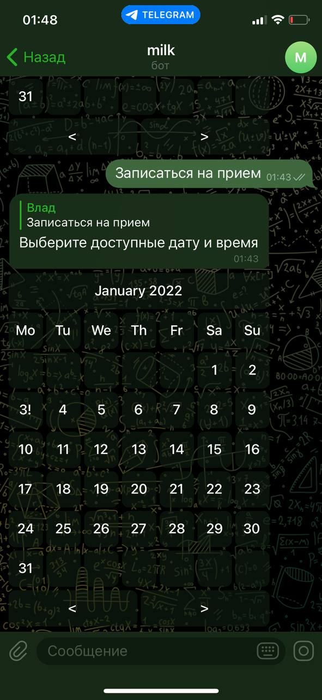

# Calendar-Telebot
### This is Lib For creating Calendar in telegram using Telebot library and golang

#### Example of usage 

```
selector := &tele.ReplyMarkup{}

	btnBook := selector.Text("Записаться на прием")

	selector.InlineKeyboard = telebotCalendar.GenerateCalendar(2022, 1)
	MilkBot.Handle(&btnBook, func(c tele.Context) error {
		return c.EditOrReply("Выберите доступные дату и время", selector)
	})

```

#### Example of calendar

